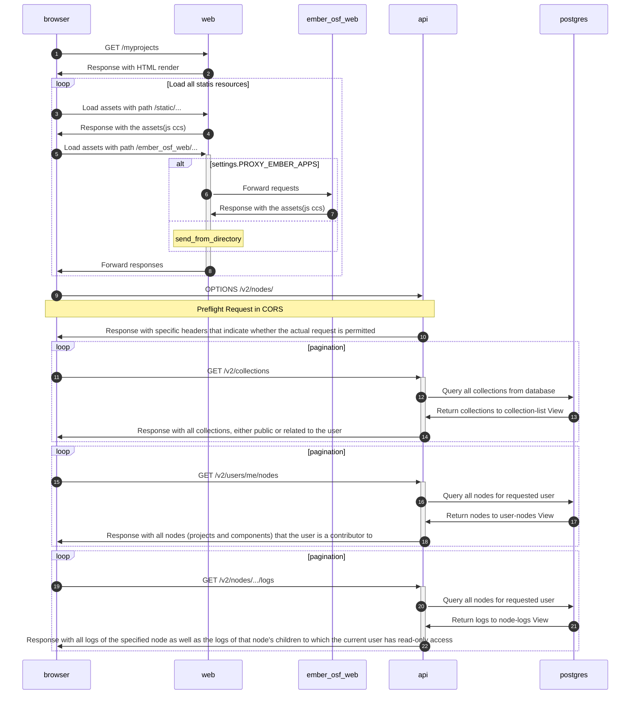

## myprojects ページを表示した時のシーケンス図



## 特定のプロジェクト`Test project 10` を開いた時のシーケンス図

```mermaid
sequenceDiagram
 autonumber
 participant browser
 participant web
 participant api
 participant mfr
 participant wb
 participant postgres


 browser ->> web: GET /<node_id>
 web ->> browser: Response with HTML render


 Note right of browser: Load static resources
 loop
    browser ->> web: Load assets with path /static/...
    web ->> browser: Response with the assets(js ccs)
 end


 browser ->> api: OPTIONS /v2/nodes/
 Note over browser,api: Preflight Request in CORS
 api ->> browser: Response with specific headers that indicate whether the actual request is permitted


 par Initialize comment pane
    loop pagination
    browser ->>+ api: GET /v2/nodes/<node_id>/comments
    api ->> postgres: Query all comments from database
    postgres ->> api: Return comments to node-comments View
    api ->>- browser: Response with comments are sorted by their creation date
    end
    loop pagination
    browser ->>+ api: GET /v2/nodes/<node_id>/contributors_and_group_members/
    api ->> postgres: Query all contributors_and_group_members related to this node
    postgres ->> api: Return contributors_and_group_members to node-contributors-and-group-members View
    api ->>- browser: Response with the node's contributors_and_group_members
    end
 
 and Recent Activity widget rendering
    loop pagination
    browser ->>+ api: GET /v2/nodes/<node_id>/logs/
    api ->> postgres: Query all logs related to this node
    postgres ->> api: Return logs to node-logs View
    api ->>- browser: Response with all logs associated with a given node
    end


 and Wiki widget markdown rendering
    browser ->>+ web: GET /api/v1/project/<node_id>/wiki/home/content
    web ->> postgres: Query all WikiVersion objects for node
    postgres ->> web: Return WikiVersion objects to wiki addons
    web ->>- browser: Response with wiki content
    

 and Rendering components and contributors
 browser ->> web: GET /api/v1/project/nkzg8
 web ->> postgres: Query node include it's children and contributors
 postgres ->> web: Return query result
 web ->> browser: Build a JSON object containing everything needed to render project.view.mako


 and Treebeard Files view rendering
    browser ->> web: GET /api/v1/project/nkzg8/files/grid
    loop node has children
        web ->> postgres: Query addons for node
        postgres ->> web: Return addons
        web ->> postgres: Query children for node
        postgres ->> web: Return children
    end
    web ->> browser: Response with the formatted data for rubeus.js/hgrid
    loop load metadata for all nodes
        browser ->> wb: GET /v1/resources/j6ev5/providers/osfstorage/
        wb ->> web: GET /api/v1/files/auth/
        web ->> wb: Response with authentication of addons
        opt Validate and get metadata from path
        wb ->> s3: GET https://s3.amazonaws.com:443/aws-xray-evaluation/
        s3 ->> wb: Response 200
        wb ->> s3: GET https://s3-ap-northeast-1.amazonaws.com:443/aws-xray-evaluation/
        s3 ->> wb: Response with metadata about the requested file or folder
        end
    end
 

 and Initialize CitationWidget
    browser ->> web: GET /api/v1/project/nkzg8/citation/
    web ->> browser: Response JSON data with citations
 

 and The Render file iframe widget
    browser ->> mfr: GET /static/js/mfr.js
    mfr ->> browser: Response with js resource
 end
```****
